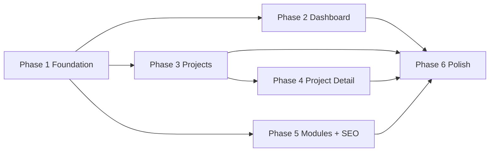

# Codev_Tim — Implementation Plan

**Document ID:** `CT-DOC-10`  
**Version:** 1.0.0  
**Status:** Canonical Specification  
**Last Updated:** 2026-07-04

---

## Preface

This document defines the **complete implementation roadmap** for Codev_Tim — from empty repository to production release. Six phases, ordered by dependency. Each phase has deliverables, acceptance criteria, and references to canonical specs.

**Rule:** Before implementing any feature, read the relevant `/docs` specification. Do not invent UI copy, slugs, or content — use canonical sources.

**Stack:** `08_TECH_STACK.md`  
**Content:** `05_CONTENT_ARCHITECTURE.md` · `03_ABOUT_TIMUR.md` · `09_PRODUCT_REGISTRY.md`  
**Language:** `02_ENGINEERING_LANGUAGE.md`  
**SEO:** `04_SEO_STRATEGY.md` · `06_SEO_CHECKLIST.md` · `07_AI_INDEXING.md`  
**Experience:** `00_PROJECT_VISION.md` · `01_BRAND_BIBLE.md`

**Target:** Lighthouse 95+ · WCAG AA · EN/RU/UZ · Production on Vercel

---

## Overview

```
Phase 1  Foundation          Shell, tokens, routing, boot — everything else depends on this
Phase 2  Dashboard           Richest screen — validates the OS metaphor
Phase 3  Projects            Product Registry — catalog, cards, filters
Phase 4  Project Detail      Largest page — MDX docs, architecture, TOC
Phase 5  Remaining Modules    About, Writing, Contact + full SEO layer
Phase 6  Polish              Motion, a11y, performance, pre-release checklist
```

### Phase Dependency Graph



### Estimated Scope

| Phase | Relative Effort | Blocking |
|-------|-----------------|----------|
| Phase 1 | 25% | Everything |
| Phase 2 | 20% | Phase 3–6 UX validation |
| Phase 3 | 12% | Phase 4 |
| Phase 4 | 22% | Content depth |
| Phase 5 | 14% | Production SEO |
| Phase 6 | 7% | Release |

---

## Repository Structure (Target)

```
codev-tim/
├── docs/                          # Canonical specs (existing)
├── content/
│   ├── site/config.json
│   ├── profile/
│   ├── projects/{slug}/
│   ├── principles/
│   └── writing/{slug}/
├── messages/
│   ├── en.json
│   ├── ru.json
│   └── uz.json
├── public/
│   ├── favicon.ico
│   ├── favicon.svg
│   ├── site.webmanifest
│   ├── og/default.png
│   ├── robots.txt
│   └── llms.txt
├── src/
│   ├── app/
│   │   ├── [locale]/
│   │   │   ├── layout.tsx           # AppShell wrapper
│   │   │   ├── page.tsx             # Dashboard
│   │   │   ├── projects/
│   │   │   ├── about/
│   │   │   ├── principles/
│   │   │   ├── writing/
│   │   │   └── contact/
│   │   ├── sitemap.ts
│   │   └── robots.ts
│   ├── components/
│   │   ├── shell/                   # Header, Sidebar, StatusBar
│   │   ├── ui/                      # Primitives
│   │   └── modules/                 # Dashboard, Projects, etc.
│   ├── features/
│   │   ├── boot/                    # Boot sequence
│   │   ├── terminal/                # System Console
│   │   ├── command-palette/
│   │   └── i18n/
│   ├── lib/
│   │   ├── content/                 # MDX loaders, parsers
│   │   ├── seo/                     # Metadata, JSON-LD builders
│   │   └── utils/
│   └── styles/
│       ├── globals.css
│       └── tokens.css
├── next.config.ts
├── tailwind.config.ts
├── tsconfig.json
└── package.json
```

---

## Phase 1 — Foundation

**Goal:** Runnable Next.js application with persistent OS shell, design system, routing, and placeholder systems. Visitor sees the frame — not a website.

### 1.1 Project Initialization

| Task | Detail |
|------|--------|
| Init Next.js 15 | App Router, TypeScript strict, ESLint, Tailwind v4 |
| Configure path aliases | `@/components`, `@/lib`, `@/features`, `@/content` |
| Install dependencies | See `08_TECH_STACK.md` §2 — no shadcn/MUI |
| Husky + lint-staged | Pre-commit lint |
| `.env.example` | `SITE_URL`, `NEXT_PUBLIC_GA_ID` |

**Dependencies:**
```
next@15, react, react-dom, typescript
tailwindcss@4, clsx, tailwind-merge
next-intl, framer-motion
geist (via next/font)
lucide-react
zod, react-hook-form (install now, use Phase 5)
```

### 1.2 Design Tokens and Theme

| Task | File | Reference |
|------|------|-----------|
| CSS variables — surfaces | `src/styles/tokens.css` | `00_PROJECT_VISION.md` §5.5 |
| CSS variables — accent, text, borders | same | `#07090F`, `#F0B429` |
| CSS variables — motion | same | 120ms / 200ms / 400ms |
| CSS variables — spacing | same | 4px grid |
| Global styles | `src/styles/globals.css` | Noise overlay 2%, grid 4% |
| Tailwind theme extension | `tailwind.config.ts` | Map tokens to utilities |
| `prefers-reduced-motion` | globals.css | Disable animations |

**Token naming:**
```css
--bg-base, --bg-recessed, --bg-surface, --bg-elevated, --bg-overlay
--text-primary, --text-secondary, --text-tertiary
--accent, --accent-hover, --accent-muted
--border-rest, --border-hover, --border-active, --border-accent
--motion-fast, --motion-base, --motion-slow
--header-height: 56px
--status-bar-height: 32px
--sidebar-width: 240px
```

### 1.3 Typography

| Task | Detail |
|------|--------|
| Geist Sans via `next/font` | Weights: 400, 500 — preload |
| Geist Mono via `next/font` | Weight: 400 — preload or async |
| Type scale utilities | display, heading-lg/md/sm, body, label, mono, metric |
| `tabular-nums` on metrics | Dashboard numbers |
| Max-width prose | 60ch body, 720px content |

### 1.4 Internationalization (Shell)

| Task | Detail |
|------|--------|
| next-intl setup | Locales: `en`, `ru`, `uz` — default `en` |
| Route structure | `/[locale]/...` |
| `messages/en.json` | Shell strings: nav, status, errors, MODULE labels |
| `messages/ru.json` | UI strings (body content may fallback EN initially) |
| `messages/uz.json` | UI strings |
| Language switcher component | Header dropdown — ELS labels |
| Middleware | Locale detection, redirect `/` → `/en` |

### 1.5 Routing

| Route | Module | Phase |
|-------|--------|-------|
| `/[locale]` | Operations Center | 2 |
| `/[locale]/projects` | Product Registry | 3 |
| `/[locale]/projects/[slug]` | Engineering Record | 4 |
| `/[locale]/about` | Engineer Profile | 5 |
| `/[locale]/principles` | Engineering Protocols | 5 |
| `/[locale]/writing` | Knowledge Base | 5 |
| `/[locale]/writing/[slug]` | Engineering Note | 5 |
| `/[locale]/contact` | Communication Module | 5 |
| `not-found.tsx` | Missing Module | 1 (basic) |

Phase 1: all routes exist as **placeholder pages** with ModuleHeader only.

### 1.6 AppShell

| Component | Spec |
|-----------|------|
| `AppShell` | Wraps all `[locale]` pages — persistent |
| `AppHeader` | 56px — wordmark, version badge, breadcrumb slot, language, ⌘K trigger, status dot |
| `Sidebar` | 240px — Module Navigation, terminal toggle |
| `StatusBar` | 32px fixed bottom — operational, focus, availability, timezone, version |
| `ContentViewport` | Main area — page transitions wrapper |
| `ModuleHeader` | MODULE label + identity name + description |

**Nav items (fixed order):**
```
Operations Center, Product Registry, Engineer Profile,
Engineering Protocols, Knowledge Base, Communication Module
```

**Behavior:**
- Sidebar active item: amber left rail 2px + elevated bg
- Shell never unmounts on navigation
- Mobile: sidebar → overlay; status bar compacts

### 1.7 Boot Sequence

| Step | Timing | Element |
|------|--------|---------|
| 1 | 0ms | `#07090F` base |
| 2 | 0–200ms | Shell frame mounts (header → sidebar → status bar) |
| 3 | 200ms | Status dot appears, pulse starts |
| 4 | 300ms | Wordmark + version badge |
| 5 | 400–800ms | Content viewport mounts |
| 6 | 1000ms | Terminal cursor blink ready |

**Implementation:** `BootProvider` + CSS animation classes. `prefers-reduced-motion`: instant.

### 1.8 Command Palette (Skeleton)

| Task | Detail |
|------|--------|
| `CommandPalette` component | ⌘K / Ctrl+K toggle |
| Overlay | Blur backdrop, centered modal |
| Placeholder | `Query modules, products, notes...` |
| Static module list | 6 nav items — navigable |
| Keyboard | Esc dismiss, ↑↓ navigate, Enter select |
| Dynamic import | Lazy load on first open |

Full search — Phase 5.

### 1.9 Terminal (Stub)

| Task | Detail |
|------|--------|
| `Terminal` panel component | Collapsible, 280px default height |
| Toggle | Sidebar button + `` ` `` keyboard shortcut |
| Shell header | `Codev_Tim shell v0.9.4` |
| Prompt | `> ` amber cursor blink |
| Commands (stub) | `help`, `clear`, `version` — static responses per `02_ENGINEERING_LANGUAGE.md` §10 |
| Unknown command | ELS error message |
| History | ↑↓ in sessionStorage |
| Dynamic import | Lazy load |

Full commands — Phase 2.

### 1.10 Foundation Content

| File | Source |
|------|--------|
| `content/site/config.json` | `05_CONTENT_ARCHITECTURE.md` §14.1 + `03_ABOUT_TIMUR.md` |
| Load site config at build | version, mission, status, availability, engineer |

### 1.11 Phase 1 Deliverables

- [ ] `npm run dev` — app runs at `/en`
- [ ] AppShell visible on all routes
- [ ] Design tokens applied — dark theme, amber accent
- [ ] Geist fonts loaded
- [ ] 3 locales switch without reload break
- [ ] Boot sequence plays once per session
- [ ] ⌘K opens palette (module list only)
- [ ] Terminal opens, `help`/`clear`/`version` work
- [ ] Status bar shows live config data
- [ ] Placeholder pages for all modules
- [ ] 404 returns Missing Module page
- [ ] No console errors

### 1.12 Phase 1 Exit Criteria

> Visitor opens `/en` and sees a dark engineering shell with sidebar, status bar, and empty module viewport — not a landing page.

---

## Phase 2 — Dashboard (Operations Center)

**Goal:** Richest screen. Validates OS metaphor, data density, motion, and responsive behavior.

### 2.1 System Header Card

| Field | Source |
|-------|--------|
| System Status | `config.json` → Operational |
| Current Mission | Building Codev ERP |
| Version | v0.9.4 |
| Location | Tashkent |
| Timezone | UTC+5 |

Layout: key-value grid, mono values, status dot with pulse.

### 2.2 Dashboard Cards

| Card | Preview Data | Links to |
|------|--------------|----------|
| Projects | `{n} products · latest name` | `/projects` |
| Articles | `{n} notes · latest title` | `/writing` |
| Technologies | layer counts | `/about#stack` |
| Experience | period summary | `/about` |
| Architecture | mini blueprint preview | featured project |
| Current Stack | top 5 tech tags | `/about#stack` |
| Latest Activity | last 3 log entries | contextual |
| Principles | count preview | `/principles` |

**Card behavior:**
- Hover: border brighten, Signal line, translateY(-1px), metrics reveal (200ms delay)
- Click: module transition to target
- Stagger mount: 50ms per card

### 2.3 Activity Log

| Task | Detail |
|------|--------|
| `ActivityLog` component | Monospace timestamps |
| Static seed entries | From `content/activity/log.json` or generated |
| Format | `[HH:MM] Module accessed: {name}` |
| Optional | Append on navigation (client, session) |

### 2.4 Terminal (Functional)

Implement all commands from `02_ENGINEERING_LANGUAGE.md` §10:

```
help, projects, about, stack, contact, status, mission,
version, whoami, open [module], search [query], clear, lang [en|ru|uz]
```

Responses use live config + product registry data (hardcoded or JSON until Phase 3).

### 2.5 Page Transition

| Transition | Spec |
|--------------|------|
| Dashboard → peer module | Crossfade 200ms |
| Content | translateY(8px→0) |
| Shell | Static — no animation |
| Prefetch | Hover nav >100ms → prefetch route |

### 2.6 Responsive Dashboard

| Breakpoint | Layout |
|------------|--------|
| Desktop ≥1280 | 3-column card grid |
| Tablet 768–1279 | 2-column |
| Mobile <768 | 1-column, bottom tab bar, terminal full-screen overlay |

### 2.7 Dashboard Metadata

```typescript
title: "Operations Center — Codev_Tim"
description: from 04_SEO_STRATEGY.md §7.1
JSON-LD: WebSite, SearchAction, Organization
```

Basic metadata in Phase 2; full SEO Phase 5.

### 2.8 Phase 2 Deliverables

- [ ] System Header Card with live config
- [ ] 8 dashboard cards with real preview data
- [ ] Activity log renders
- [ ] Terminal fully functional (all commands)
- [ ] Card hover animations
- [ ] Number count-up on first viewport entry (once)
- [ ] Module transition from dashboard cards
- [ ] Responsive grid all breakpoints
- [ ] Dashboard metadata + WebSite JSON-LD

### 2.9 Phase 2 Exit Criteria

> Dashboard feels like an operations center — status, mission, module shortcuts, activity, terminal — not a hero section.

---

## Phase 3 — Projects (Product Registry)

**Goal:** Catalog of registered products with premium cards, filtering, and URL state.

### 3.1 Content Layer

| Task | Detail |
|------|--------|
| `content/projects/{slug}/meta.json` | Per `09_PRODUCT_REGISTRY.md` — 6 products |
| `content/projects/{slug}/index.en.mdx` | Minimal overview (Phase 4 expands) |
| Content loader | `lib/content/projects.ts` — read all, validate Zod schema |
| Slug redirect | `erp-platform` → `codev-erp` 301 in `next.config.ts` |

### 3.2 Product Registry Page

| Element | Spec |
|---------|------|
| ModuleHeader | Product Registry |
| FilterBar | Status enum + Domain enum |
| URL sync | `?status=production&domain=...` |
| Sort | `order` field + status priority: In Development → Production → Experimental → Archived |
| Card list | Vertical — not image grid |

### 3.3 ProjectCard Component

Per `01_BRAND_BIBLE.md` and Experience Spec:

```
[Title]                    [StatusBadge]
[Subtitle]

Status     [badge]
Stack      [mono tags]
Blueprint  [Client → API → ...] — highlights on hover

Open Project →
```

Hover metrics: version, domain, since (when available).

### 3.4 StatusBadge Component

Enum from `05_CONTENT_ARCHITECTURE.md` §9.3 — color-coded dot + label.

### 3.5 Filter Behavior

| Filter | Canonical rule |
|--------|----------------|
| Empty result | `No registered products match current filter.` + Clear Filter |
| Canonical URL | Base `/projects` unless SEO decision otherwise |

### 3.6 Module Transition

Projects index → Project detail: slide from right 12px (drill-down).

### 3.7 Registry Metadata

```typescript
title: "Product Registry — Codev_Tim"
JSON-LD: CollectionPage, ItemList, BreadcrumbList
```

### 3.8 Phase 3 Deliverables

- [ ] 6 products loaded from content
- [ ] Product Registry page with cards
- [ ] Status + domain filters with URL sync
- [ ] ProjectCard hover behavior
- [ ] Empty filter state (ELS)
- [ ] Breadcrumb: Operations Center / Product Registry
- [ ] ItemList JSON-LD
- [ ] 301 redirect erp-platform → codev-erp
- [ ] Terminal `projects` command lists all products

### 3.9 Phase 3 Exit Criteria

> Registry reads as production system catalog — structured metadata, architecture preview, status lifecycle — not portfolio thumbnails.

---

## Phase 4 — Project Detail (Engineering Record)

**Goal:** Largest page. Full documentation template — the proof of engineering depth.

### 4.1 MDX Content Structure

Each project `index.{locale}.mdx` with fixed section order:

```
1. Overview
2. Problem Statement
3. Business Context
4. System Blueprint
5. Technology Stack
6. Trade-offs
7. Roadmap
8. Interface Record
9. Lessons Recorded
```

MDX components: `Callout`, `TradeoffTable`, `CodeBlock`, `ScreenshotFrame`.

### 4.2 ProjectDocLayout

| Zone | Component |
|------|-----------|
| Module header | ← Back to Product Registry (origin-aware) |
| Title block | name, subtitle, status, version, stack tags |
| TOC sidebar | sticky — scroll spy, amber indicator |
| Content | max 720px |
| Footer nav | ← Previous Record · Next Record → |

### 4.3 ArchitectureDiagram Component

| Feature | Spec |
|---------|------|
| SVG inline | Vertical flow: Client → Gateway? → API → Services → Database → Infrastructure |
| Node hover | Border accent + connected paths brighten |
| Unconnected dim | 25% opacity |
| Tooltip | Component role + technology |
| Responsive | Same vertical layout mobile |

### 4.4 Trade-offs Table

| Column | Decision · Alternative · Rationale · Outcome |
| Expandable rows | Optional |

### 4.5 Interface Record Gallery

| Feature | Spec |
|---------|------|
| `ScreenshotFrame` | Dark device chrome, next/image, AVIF/WebP |
| Lightbox | System Window modal — Esc dismiss |
| Captions | `<figcaption>` — ELS alt rules |

### 4.6 Project Metrics (Optional Panel)

On hover/card — version, domain, since. On detail page — outcome metrics if in frontmatter.

### 4.7 Content Priority

| Project | Priority | Notes |
|---------|----------|-------|
| `codev-erp` | P0 — full doc | Primary pillar |
| `poj-pro-platform` | P0 — full doc | Production proof |
| `codev-tim` | P1 | Meta product |
| Others | P2 — minimum viable | Overview + Stack + Blueprint |

### 4.8 Anchor Navigation

- Heading IDs auto-generated
- URL hash sync: `#system-blueprint`
- Shareable deep links

### 4.9 Project Detail Metadata

```typescript
title: "{Product Name} — Engineering Record — Codev_Tim"
JSON-LD: TechArticle, SoftwareApplication, BreadcrumbList
OG image: /og/projects/{slug}.png or default
```

### 4.10 Phase 4 Deliverables

- [ ] ProjectDocLayout with TOC scroll spy
- [ ] ArchitectureDiagram interactive SVG
- [ ] All MDX section components
- [ ] codev-erp full Engineering Record content
- [ ] poj-pro-platform full Engineering Record content
- [ ] Trade-offs table component
- [ ] Screenshot gallery + modal
- [ ] Prev/Next project navigation
- [ ] Related notes slot (empty until Writing exists)
- [ ] Breadcrumb + JSON-LD per project
- [ ] Drill-down transition from registry

### 4.11 Phase 4 Exit Criteria

> CTO can read codev-erp or poj-pro-platform record and understand problem, architecture, stack, and trade-offs — without contacting Timur.

---

## Phase 5 — Remaining Modules + SEO Layer

**Goal:** Complete module set, production SEO, discovery systems, analytics.

### 5.1 Engineer Profile (`/about`)

| Section | Source |
|---------|--------|
| Identity | `03_ABOUT_TIMUR.md` §1 — data rows |
| Deployment History | timeline from §4 |
| Technology Stack | grouped layers §9 |
| Availability | Open for interesting opportunities |
| Engineering interests | §18 |

Layout: data rows, not biography prose. Person JSON-LD primary.

### 5.2 Engineering Protocols (`/principles`)

8 principles from `03_ABOUT_TIMUR.md` §10 — numbered cards.

### 5.3 Knowledge Base (`/writing`)

| Task | Detail |
|------|--------|
| Index page | Empty state: `Knowledge base contains no published notes.` |
| Article template | Ready for MDX — do not publish placeholder articles |
| Pagination | 20 per page (when content exists) |
| Filter | tag, cluster, category query params |
| RSS | `feed.xml` generation |

### 5.4 Communication Module (`/contact`)

| Element | Spec |
|---------|------|
| Availability block | data rows |
| Form | React Hook Form + Zod — Name, Email, Intent, Message |
| Intent options | Product Build, Technical Advisory, Collaboration, Other |
| Submit | API route or form service — `Message queued. Response within 6 hours.` |
| Email copy | timaiskandarov5@gmail.com — click to copy |
| ContactPage JSON-LD | |

### 5.5 SEO Infrastructure

| Task | File / Route | Reference |
|------|--------------|-----------|
| Metadata helper | `lib/seo/metadata.ts` | Title/description templates |
| JSON-LD builders | `lib/seo/schema.ts` | All types §11 |
| Dynamic sitemap | `app/sitemap.ts` | §10 |
| robots.ts | `app/robots.ts` | §9 |
| hreflang | Metadata alternates | §14 |
| OG default image | `public/og/default.png` | 1200×630 |
| OG per project | `public/og/projects/` or `@vercel/og` | |
| llms.txt | `public/llms.txt` | `07_AI_INDEXING.md` §10 |
| Canonical URLs | All pages | `{SITE_URL}` env |

### 5.6 Search

| System | Scope |
|--------|-------|
| Command Palette | Full search — modules, products, notes |
| Pagefind (optional) | Static search index at build |
| `/writing?q=` | noindex search results |

Build search index from content at compile time.

### 5.7 Analytics

| Tool | Integration |
|------|-------------|
| Vercel Analytics | `@vercel/analytics` — defer |
| Google Analytics 4 | `NEXT_PUBLIC_GA_ID` — defer, async |
| Microsoft Clarity | Optional script — defer |

### 5.8 RSS

```
/feed.xml           EN notes
/ru/feed.xml        RU notes
/uz/feed.xml        UZ notes
/projects/feed.xml  Engineering Records (optional)
```

### 5.9 i18n Content

| Priority | Scope |
|----------|-------|
| P0 | UI strings — all 3 locales |
| P1 | codev-erp MDX — EN + RU |
| P2 | poj-pro-platform MDX — EN + RU |
| P3 | UZ body content |

### 5.10 Missing Module (404)

- HTTP 404 status
- `noindex, follow`
- ELS copy + Return to Operations Center
- Terminal hint

### 5.11 Phase 5 Deliverables

- [ ] About page complete from canonical profile
- [ ] Principles page — 8 protocols
- [ ] Writing index with empty state
- [ ] Contact form functional
- [ ] sitemap.xml dynamic
- [ ] robots.txt
- [ ] llms.txt
- [ ] RSS feed.xml
- [ ] hreflang all indexable pages
- [ ] JSON-LD all page types
- [ ] Command palette full search
- [ ] Analytics integrated (deferred load)
- [ ] All module metadata complete

### 5.12 Phase 5 Exit Criteria

> All 6 modules live. Google Search Console can index site. Person schema validates. Empty Knowledge Base is intentional — not broken.

---

## Phase 6 — Polish

**Goal:** Production quality. Every interaction refined. Checklist green.

### 6.1 Motion and Micro-interactions

| Item | Spec |
|------|------|
| Module transitions | Peer vs drill-down direction |
| Card hovers | All interactive surfaces |
| Status dot pulse | 4s interval |
| Number count-up | once per session |
| Command palette | Recent actions in localStorage |
| Navigation origin | Back button labels |
| Reduced motion | Full fallback |

### 6.2 Accessibility Audit

- [ ] Keyboard: full site without mouse
- [ ] Focus rings: amber 2px offset
- [ ] Screen reader: module announcements
- [ ] Skip to content
- [ ] aria-labels on icon buttons
- [ ] WCAG AA contrast audit
- [ ] axe-core / Lighthouse a11y ≥95

### 6.3 Performance Audit

| Target | Tool |
|--------|------|
| Lighthouse Performance ≥95 | All page types |
| LCP <1.5s | Dashboard, one Record |
| CLS <0.05 | All pages |
| INP <100ms | Interaction test |
| Bundle audit | Terminal + palette lazy |
| Image audit | All screenshots optimized |

### 6.4 Cross-Browser and Device

- [ ] Chrome, Firefox, Safari, Edge
- [ ] iOS Safari, Android Chrome
- [ ] 375px, 768px, 1280px, 1440px

### 6.5 Content QA

- [ ] All copy passes ELS lint
- [ ] No forbidden words
- [ ] All internal links valid
- [ ] No orphan pages
- [ ] config.json matches 03_ABOUT_TIMUR.md
- [ ] Product registry matches 09_PRODUCT_REGISTRY.md

### 6.6 SEO Pre-Release

Run complete `06_SEO_CHECKLIST.md`:

- [ ] All Critical items green
- [ ] Rich Results Test — all page types
- [ ] GSC sitemap submitted
- [ ] Bing + Yandex submitted
- [ ] OG/Twitter cards verified

### 6.7 AI Indexing

Run `07_AI_INDEXING.md` §14:

- [ ] llms.txt accurate
- [ ] Pillar pages: Dashboard, About, codev-erp
- [ ] Answer-first paragraphs on all records
- [ ] Person knowsAbout complete

### 6.8 Final UX Pass

| Test | Expected |
|------|----------|
| First visit | Boot sequence → Dashboard |
| Return visit | Session restored, warm load ≤240ms |
| CTO path | Registry → codev-erp → Architecture |
| Developer path | Terminal → stack → projects |
| HR path | About → Deployment History |
| Leave site feeling | "Explored an engineering OS" |

### 6.9 Production Deploy

| Task | Detail |
|------|--------|
| Vercel project | Connect repo |
| Env vars | `SITE_URL`, `NEXT_PUBLIC_GA_ID` |
| Domain | Configure when confirmed |
| Preview deploys | Per PR |
| Production deploy | v1.0.0 tag |

### 6.10 Phase 6 Deliverables

- [ ] `06_SEO_CHECKLIST.md` — 100% Critical pass
- [ ] Lighthouse ≥95 all modules
- [ ] Zero console errors
- [ ] Production deploy on Vercel
- [ ] Version bump to v1.0.0

### 6.11 Phase 6 Exit Criteria

> Codev_Tim v1.0.0 production. Visitor concludes: *This person builds products that companies depend on.*

---

## Implementation Order (Sprint View)

### Sprint 1 — Phase 1 (Foundation)
```
Day 1–2:  Init, tokens, typography, i18n
Day 3–4:  AppShell, routing, placeholders
Day 5:    Boot sequence, status bar, sidebar
Day 6–7:  Command palette stub, terminal stub, 404
```

### Sprint 2 — Phase 2 (Dashboard)
```
Day 1–2:  System header card, dashboard grid
Day 3:    Activity log, card animations
Day 4–5:  Terminal full commands
Day 6–7:  Responsive, transitions, dashboard SEO basics
```

### Sprint 3 — Phase 3 (Projects)
```
Day 1–2:  Content layer, Zod schemas, 6 products JSON
Day 3–4:  Registry page, ProjectCard, filters
Day 5:    Redirects, metadata, terminal projects cmd
```

### Sprint 4 — Phase 4 (Project Detail)
```
Day 1–2:  ProjectDocLayout, TOC scroll spy
Day 3–4:  ArchitectureDiagram SVG
Day 5–6:  MDX components, TradeoffsTable
Day 7–10: Content: codev-erp + poj-pro-platform full records
Day 11:   Gallery, prev/next, project SEO
```

### Sprint 5 — Phase 5 (Modules + SEO)
```
Day 1–2:  About, Principles
Day 3:    Contact form
Day 4:    Writing empty state, article template
Day 5–7:  SEO infrastructure — sitemap, robots, JSON-LD, hreflang
Day 8:    Search, RSS, llms.txt, analytics
Day 9:    i18n RU UI + EN/RU content
```

### Sprint 6 — Phase 6 (Polish)
```
Day 1–2:  Motion pass, a11y audit
Day 3:    Performance optimization
Day 4:    SEO checklist full run
Day 5:    Cross-browser, production deploy
```

---

## Risk Register

| Risk | Mitigation |
|------|------------|
| Domain not confirmed | Use Vercel preview URL; `SITE_URL` env at deploy |
| No Knowledge Base articles at launch | Empty state — intentional per 03_ABOUT_TIMUR.md |
| MDX complexity | Start with markdown sections; add components incrementally |
| i18n content lag | UI fully translated; body EN first, RU second |
| Contact form backend | Start with `mailto:` fallback or Formspree; API route later |
| Performance with Framer Motion | Lazy load; reduced motion; minimal animation count |
| 6 projects — content depth | P0: 2 full records; others minimum viable |

---

## Definition of Done (Project)

Codev_Tim v1.0.0 is done when:

1. All 6 phases exit criteria met
2. `06_SEO_CHECKLIST.md` Critical items — 100% pass
3. All 9 canonical `/docs` specifications reflected in implementation
4. 6 products in Product Registry with 2 full Engineering Records
5. Engineer Profile matches `03_ABOUT_TIMUR.md` v2.0.0
6. EN/RU/UZ UI complete; EN content minimum
7. Production on Vercel
8. Timur sign-off on Release Sign-Off form (`06_SEO_CHECKLIST.md`)

---

## Document Relationships

```
10_IMPLEMENTATION_PLAN.md  → This document — how to build
08_TECH_STACK.md           → What to build with
11_DESIGN_TOKENS.md        → Visual tokens (Phase 1 §1.2)
12_CONTENT_SCHEMA.md       → Content models (Phase 3+)
13_ARCHITECTURE_DECISIONS.md → ADRs
05_CONTENT_ARCHITECTURE.md → Content file structure
09_PRODUCT_REGISTRY.md     → Products to implement
06_SEO_CHECKLIST.md        → When ready to ship
.cursor/rules.md           → AI agent rules
```

---

*End of canonical specification. Update phase status as implementation progresses.*
