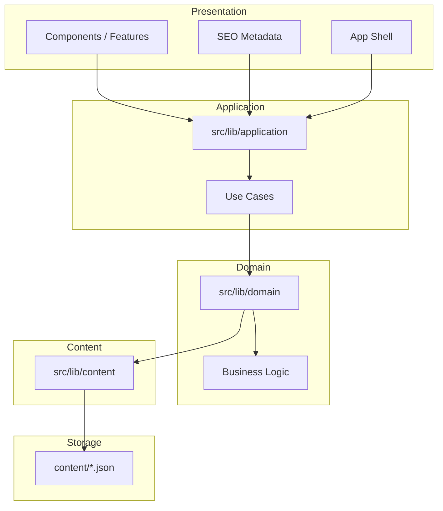

# Codev_Tim — Application Layer

**Document ID:** `CT-DOC-18`  
**Version:** 1.0.0  
**Status:** Canonical  
**Effective:** 2026-07-05

---

## 1. Purpose

The Application Layer owns **use cases and orchestration**. It sits between Presentation (UI) and Domain, and is the **only entry point** Presentation may call for business data.

```
Presentation (UI)
       ↓
Application Layer     ← use cases, orchestration, future auth/cache/analytics
       ↓
Domain Layer          ← pure business logic, view-model builders
       ↓
Content Layer         ← typed storage access
       ↓
Storage               ← JSON / MDX / CMS / API / DB
```

Presentation never assembles business objects, merges datasets, or calculates metrics directly.

---

## 2. Architecture Diagram



---

## 3. Layer Responsibilities

| Layer            | Owns                                                                           | Must not own                                     |
| ---------------- | ------------------------------------------------------------------------------ | ------------------------------------------------ |
| **Presentation** | render, events, a11y, motion, layout                                           | business rules, data composition, storage access |
| **Application**  | use cases, sequencing, request/response prep, future auth/RBAC/cache/analytics | React, DOM, CSS, routing                         |
| **Domain**       | calculations, view-model builders, ranking, formatting                         | orchestration, page workflows, React             |
| **Content**      | typed reads, search index metadata                                             | business rules, UI                               |
| **Storage**      | raw files / DB                                                                 | application logic                                |

---

## 4. Dependency Graph

### Allowed

```
UI → Application → Domain → Content → Storage
lib/terminal (parser) → Application (data only)
lib/dashboard (motion/session) → Application (types + helpers)
lib/seo → Application
```

### Forbidden

```
UI → Domain
UI → Content
UI → Storage
Application → Storage
Application → Content (direct)
Domain → Storage (direct JSON)
Domain → React
```

---

## 5. Module Structure

```
src/lib/application/
  dashboard/        Operations Center use cases
  projects/         Product Registry use cases (Phase 3-ready)
  articles/         Knowledge Base use cases
  terminal/         Terminal context use case
  navigation/       Navigation use case
  search/           Search use case
  shared/           Site configuration use case
  index.ts          public API + type re-exports
```

---

## 6. Public API

### Dashboard

| Use Case                      | Returns              | Domain Functions Composed             |
| ----------------------------- | -------------------- | ------------------------------------- |
| `loadOperationsCenter()`      | `OperationsCenterVM` | header, cards, metrics, activity feed |
| `loadDashboardCards()`        | `DashboardCardVM[]`  | `buildDashboardCards`                 |
| `loadDashboardMetrics()`      | `DashboardMetricsVM` | `calculateDashboardMetrics`           |
| `loadActivityFeed()`          | `ActivityEntryVM[]`  | `formatActivityFeed`                  |
| `loadStaticActivityRecords()` | `ActivityRecord[]`   | `selectStaticActivityRecords`         |
| `loadHeaderInformation()`     | `HeaderVM`           | `buildHeaderInformation`              |
| `loadCurrentMission()`        | `string`             | `extractCurrentMission`               |
| `mergeActivityFeed(...)`      | `ActivityEntryVM[]`  | static + session merge                |

### Projects

| Use Case                    | Returns                       |
| --------------------------- | ----------------------------- |
| `loadProductRegistry()`     | `ProductRegistryVM`           |
| `loadProject(slug)`         | `RegistryCardVM \| undefined` |
| `loadProductMetrics()`      | `ProductMetricsVM`            |
| `loadFeaturedProducts()`    | `RegistryCardVM[]`            |
| `loadProductionProducts()`  | `RegistryCardVM[]`            |
| `loadDevelopmentProducts()` | `RegistryCardVM[]`            |
| `loadArchivedProducts()`    | `RegistryCardVM[]`            |

### Articles

| Use Case                            | Returns                      |
| ----------------------------------- | ---------------------------- |
| `loadKnowledgeBase()`               | `KnowledgeBaseVM`            |
| `loadArticle(slug)`                 | `ArticleCardVM \| undefined` |
| `loadRecentArticles(limit?)`        | `ArticleCardVM[]`            |
| `loadRelatedArticles(slug, limit?)` | `ArticleCardVM[]`            |

### Terminal

| Use Case                | Returns             |
| ----------------------- | ------------------- |
| `loadTerminalContext()` | `TerminalContextVM` |

Re-exports: `LOCALE_CODES`, `MODULE_OPEN_ALIASES`, `MODULE_LABELS`

### Navigation

| Use Case                 | Returns                         |
| ------------------------ | ------------------------------- |
| `loadNavigation()`       | `NavigationItemVM[]`            |
| `loadNavigationItem(id)` | `NavigationItemVM \| undefined` |

### Search

| Use Case                         | Returns               |
| -------------------------------- | --------------------- |
| `executeSearch(query, options?)` | `SearchQueryResult[]` |

### Shared

| Use Case                  | Returns           |
| ------------------------- | ----------------- |
| `loadSiteConfiguration()` | `SiteShellConfig` |

### Type Re-exports

View-model types are re-exported from `@/lib/application` so Presentation never imports `@/lib/domain` for types.

---

## 7. Import Rules

### Presentation (components, features, app routes)

```typescript
// ✅ Allowed
import { loadDashboardCards, type DashboardCardVM } from "@/lib/application";

// ❌ Forbidden
import { buildDashboardCards } from "@/lib/domain";
import { getArticles } from "@/lib/content";
import articles from "content/writing/index.json";
```

### Application

```typescript
// ✅ Allowed
import { buildDashboardCards } from "@/lib/domain/dashboard";

// ❌ Forbidden
import { getArticles } from "@/lib/content";
import config from "content/site/config.json";
```

### Domain

```typescript
// ✅ Allowed
import { getSiteConfig } from "@/lib/content";

// ❌ Forbidden
import { loadDashboardCards } from "@/lib/application";
import { useState } from "react";
```

---

## 8. Examples

### Server Component (Dashboard Grid)

```typescript
import { loadDashboardCards } from "@/lib/application";

export async function DashboardGrid() {
  const cards = await Promise.resolve(loadDashboardCards());
  // render only — no business logic
}
```

### Client Component (Activity Feed Merge)

```typescript
import {
  mergeActivityFeed,
  type ActivityRecord,
  type ActivityMessageTemplates,
} from "@/lib/application";

const entries = mergeActivityFeed(staticEntries, sessionEntries, templates);
```

### Terminal (via lib/terminal adapter)

```typescript
import { loadTerminalContext as getTerminalContext } from "@/lib/application";
// lib/terminal/get-terminal-context.ts re-exports for backward compatibility
```

---

## 9. Extension Guide

### Adding a new page use case

1. Add pure builder/calculator in `@/lib/domain/<module>/`
2. Add orchestrating use case in `@/lib/application/<module>/`
3. Export function + types from `@/lib/application/index.ts`
4. Import only from `@/lib/application` in Presentation
5. Update this document

### Adding cross-module orchestration

Place composition in Application, not Domain:

```typescript
// application/projects/index.ts
export function loadProjectDetail(slug: string) {
  const project = buildProjectViewModel(slug);
  const related = selectRelatedArticles(slug);
  return { project, related };
}
```

Domain functions remain single-purpose.

---

## 10. Future Backend Migration

The Application Layer is the **swap boundary** for infrastructure:

| Today                                  | Future                                  |
| -------------------------------------- | --------------------------------------- |
| Domain reads Content (JSON)            | Domain unchanged                        |
| Application calls Domain synchronously | Application calls Domain after fetch    |
| `loadProject(slug)`                    | `loadProject(slug)` — same signature    |
| Session activity in browser            | Application persists via API            |
| `executeSearch` in-process             | Application delegates to search service |

Presentation imports stay on `@/lib/application` regardless of backend.

Planned hooks (not yet implemented):

- Authentication / session context in use-case entry
- RBAC guards before Domain calls
- Feature flags per use case
- Analytics events after successful loads
- Response caching policies

---

## 11. Domain Rename Reference

Application use cases replace former Domain `get*` orchestration names:

| Application                   | Domain (pure)                   |
| ----------------------------- | ------------------------------- |
| `loadHeaderInformation()`     | `buildHeaderInformation()`      |
| `loadDashboardMetrics()`      | `calculateDashboardMetrics()`   |
| `loadDashboardCards()`        | `buildDashboardCards()`         |
| `loadActivityFeed()`          | `formatActivityFeed()`          |
| `loadStaticActivityRecords()` | `selectStaticActivityRecords()` |
| `loadProductRegistry()`       | `buildProductRegistry()`        |
| `loadProject(slug)`           | `buildProjectViewModel(slug)`   |
| `loadKnowledgeBase()`         | `buildKnowledgeBase()`          |
| `loadTerminalContext()`       | `buildTerminalContext()`        |
| `loadNavigation()`            | `buildNavigationView()`         |
| `loadSiteConfiguration()`     | `buildShellConfiguration()`     |
| `executeSearch(query)`        | `buildSearchRanking(query)`     |

`getOperationsCenter()` removed from Domain — orchestration lives in `loadOperationsCenter()`.

---

## 12. Verification Checklist

- [ ] No `@/lib/domain` imports in `src/components`, `src/features`, `src/app`
- [ ] No `@/lib/content` imports outside `src/lib/domain` and `src/lib/content`
- [ ] No direct `content/*.json` imports outside `src/lib/content/internal/sources.ts`
- [ ] Application does not import Storage or Content directly
- [ ] Build and typecheck pass with zero behavior change

---

## 13. Related Documents

- [Content Layer](./16_CONTENT_LAYER.md)
- [Domain Layer](./17_DOMAIN_LAYER.md)
